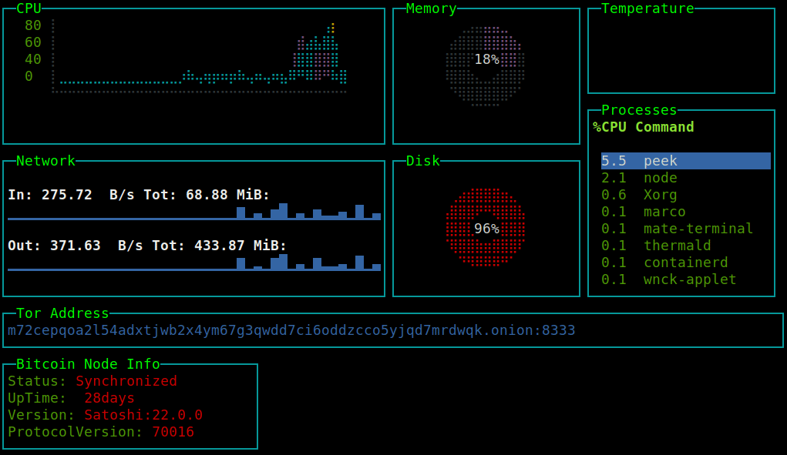

# Satoshi Top

Bitcoin full node monitoring dashboard for terminal



## Features
- general system resources: cpu, mem, disk, network, processes, temperature
- bitcoin core specific: status, tor address, 

Many other features are work in progress, this project has been organized in small readable and easy to edit files to encourage contributions from the active community of developers and bitcoiners, every Pull Request and suggestion is welcome.

### Requirements

* Linux / OSX / Windows (partial support)
* Node.js >= v8

### Installation

```sh
$ npm install satop -g
```
Copy config file `dot.satoprc.example` in path `$HOME/.satoprc` and add bitcoin rpc user and password.
Don't forget to set restrictive read permissions for this file, for example: `chmod 0600 ~/.satoprc`)

### Usage

Start Satoshi Top with the `satop` command in system terminal(the same system whose resources you want to monitor).

```sh
$ satop
```

To stop satop use `q`, or `ctrl+c` in most shell environments.

Learn more...

```sh
$ satop --help
```

## License

Copyright (c) 2023, st3b1t

Released under [the MIT license](LICENSE).
