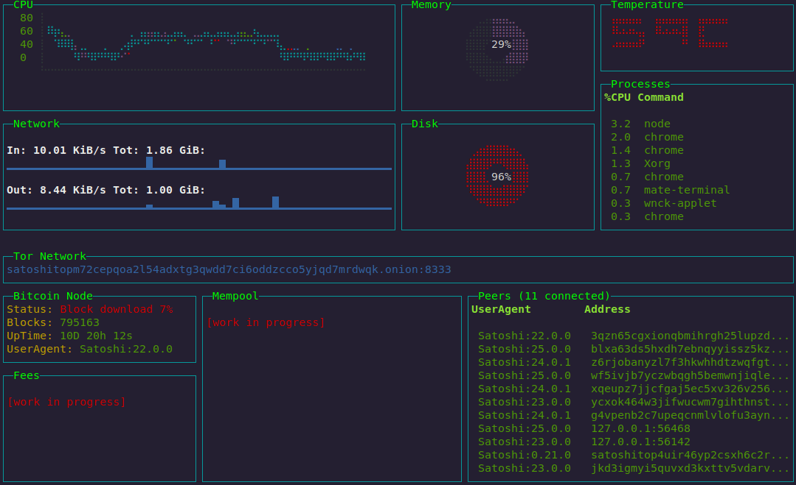

# SatoshiTop

Bitcoin full node monitoring dashboard for terminal.

[](http://badge.fury.io/js/satop)

Proposals and reporting problems: [New issue](https://github.com/st3b1t/SatoshiTop/issues/new) or contribute by voting with a 👍 in [proposals issues](https://github.com/st3b1t/SatoshiTop/labels/Proposal)

Follow me for last updates: [@st3b1t](https://twitter.com/st3b1t) or full list of [Releases](https://github.com/st3b1t/SatoshiTop/releases)




Sober and useful evolution of the senseless [SatoshiBanner](https://github.com/st3b1t/SatoshiBanner)

## Use case
You can define it an *htop for Bitcoin*... having a modern dashboard that displays a lot of informations similar
to a modern bitcoin explorer, but keeping very poor requirements, it doesn't need a graphical environment (output is ncurses)
and the data exchange is minimal suitable for slow connections like `Tor` and monitors/lcds with low resolution and low fps.

## Features
- general system resources: cpu, mem, disk, network, processes, temperature
- bitcoin core specific: status, blocks, uptime, tor, peers... (WORK IN PROGRESS)
- all in one [rpc client](https://github.com/st3b1t/SatoshiTop/tree/master#rpc-client) to control all services in your full node

**Other possibilities:**

- http rest interface: this would allow viewing through a browser, while maintaining a tiny, text-only data exchange.
- send output via tty to mini LCD with low resolution and poor in colors.

Many other features are work in progress, many more [Blessed widgets](https://github.com/chjj/blessed#widgets) and [contrib](https://github.com/yaronn/blessed-contrib#widgets) will be able to be integrated.
This project has been organized in small readable and easy to edit files to encourage contributions from the active community of developers and bitcoiners, every Pull Request and suggestion is welcome.

### Requirements

* Linux / OSX / Windows (maybe partial support)
* Node.js >= v18 and NPM

If you see question marks(?) or other different characters, try to run it with these environment variables:
```sh
export LANG=en_US.utf8 TERM=xterm-256color
```
you can add this in your ~/.profile file.

get terminal size, chars rows and columns:
```bash
$ stty size
```
it should be at least 33x100, otherwise change using `setfont` command.

In Embedded devices having little display you can use this terminal to show unicode fonts
```bash
$ apt install fbterm
$ fbterm
```

## Quick Start

Install last stable version in global from [official npm package](https://npmjs.com/package/satop)
*(Installing packages from NPM repositories is always a quick but unsafe way if you want to keep your system free of malicious packages or dependencies)*

```sh
$ npm install satop -g
$ satop --rpccookiefile=/home/<user>/.bitcoin/.cookie
```
The path `/home/<user>/.bitcoin/.cookie` depends from your Bitcoin [datadir config](https://github.com/bitcoin/bitcoin/blob/master/doc/init.md#configuration)

Or use username and password
```sh
$  satop --rpcuser=<username> --rpcpassword=<password>
```
(*All commands entered are stored in the bash history file. But we don't want the password to be stored where anyone can find it. For this, put a space in front of the command shown above.*)
If `rpccookiefile` has valid value(file exists and readble) auth method bypass any values of `rpcuser/rpcpassword` and it use only the cookie file.

## Configuration 

Satop config file is located in user home directory `$HOME/.satoprc` each parameter by command line has its counterpart inside this file, read the comments in it for more details. If the file not exists can be generated by command:

```sh
$ satop --confgen
```

## Source Code Installation

Get source code:
```sh
$ git clone https://github.com/st3b1t/SatoshiTop.git
$ cd ./SatoshiTop
```
Now you have the development version, `master` branch.

Choice a stable release from https://github.com/st3b1t/SatoshiTop/releases.
Or select latest automagically:
```sh
$ git checkout $(git describe --tags `git rev-list --tags --max-count=1`)
```

### Verify

Copy the example config file [dot.satoprc.example](./dot.satoprc.example) in your home path:
```sh
$ cp ./dot.satoprc.example ~/.satoprc
$ chmod 0600 ~/.satoprc
```

Now uncomment and set `rpccookiefile` with path od Bitcoin cookie file or set `rpcuser` and `rpcpassword`.
(*Don't forget to set restrictive read permissions for this file in case of storing rpcuser and rpcpassword*)

Install dependencies and `satop` command in the global way and try it:
```sh
$ npm install
$ npm install -g .
$ satop --version
$ satop --help
```

[Docker](./docs/docker.md) and [Snap](./docs/snap.md) setup is work in progress...

## Usage

Start SatoshiTop with the `satop` command in system terminal(the same system whose resources you want to monitor).

```sh
$ satop
```

If Bitcoin daemon listening in different address(`127.0.0.1`) or a different port(`8333`), you can use command line parameters:

```sh
$ satop --rpcconnect=192.168.0.3 --rpcport=18332
```

Or via Environment variable:

```sh
$ RPCCONNECT=192.168.0.3 RPCPORT=18332 satop
```

To stop satop use `q`, or `ctrl+c` in most shell environments.

Learn more about Environment and Command line [parameters](docs/cli.md)...

#### RPC client

From version [v2.5.0](https://github.com/st3b1t/SatoshiTop/releases/tag/v2.5.0) SatoshiTop include an additional command defined in `bin/satoprpc`.
This allows you to send RPC methodi to your full node.
Learn more:
```bash
$ satoprpc --help 
```
Show all rpc commands available in your Bitcoin RPC Node:
```bash
$ satoprpc help 
```
Now you can run only [Bitcoin rpc methods](https://developer.bitcoin.org/reference/rpc/). Coming soon are Electrum Server rpc methods and other commands for to control Lightning Network node... all in one command line! 

### Development

```sh
$ git clone https://github.com/st3b1t/SatoshiTop
$ cd SatoshiTop
$ npm install
$ npm run dev
```

This script Set environment var `FAKEMODE=true` to allow simulate a RPC connection for debugging without Bitcoin Core.

Additional parameter `--intervalrpc=1000` allows to speed up data polling and `nodemon` to reload the code at each edits.

### Contributing

Pull Requests are welcome, please make sure that your changes are tested

In order of priority how you can help out:

1. share this project in your social channels and click stars!
2. testing and report bugs in [new issue](https://github.com/st3b1t/SatoshiTop/issues/new)
3. try to resolve [easy issues](https://github.com/st3b1t/SatoshiTop/labels/good%20first%20issue))
4. search [`//TODO`](https://github.com/search?q=repo%3Ast3b1t%2FSatoshiTop%20%2F%2FTODO&type=code) in the source code
5. add new features

### Donate

Donate via Lightning Network Bolt12 ⚡ to incentivize future development and bug fixes.


lno1pgqppmsrse80qf0aara4slvcjxrvu6j2rp5ftmjy4yntlsmsutpkvkt6878s98hg39x6ct93flx6jjkpcygfnqzmap67azxk5m792zhs0mg50z8vqgpqc4ecv0ff9klzlrru7uz95jylq9nfhzc5fpk0ezgu6490tr6rrwcqx06a2clgplqdqzfgd3x4h960zypk9md35uxh4suz3frxcz9dckyfm0gs5hl5lgxt8mgawyt63nsu4lzz0pvs95j825qfsvyxcuy9ntytqa7ljz70pcqletnnuklslxgx7zrj8ylrqqertseym9scshtsgcqe0tlyfhwynug9qve279l8j6txr72qr7qrnjrkm3lh7v23vpwlk298jgf34jlrl46s


## License

Copyright (c) 2023 [st3b1t](https://github.com/st3b1t)

PGP: 0xAF2E5D05D21BA845

Released under [MIT license](LICENSE).
