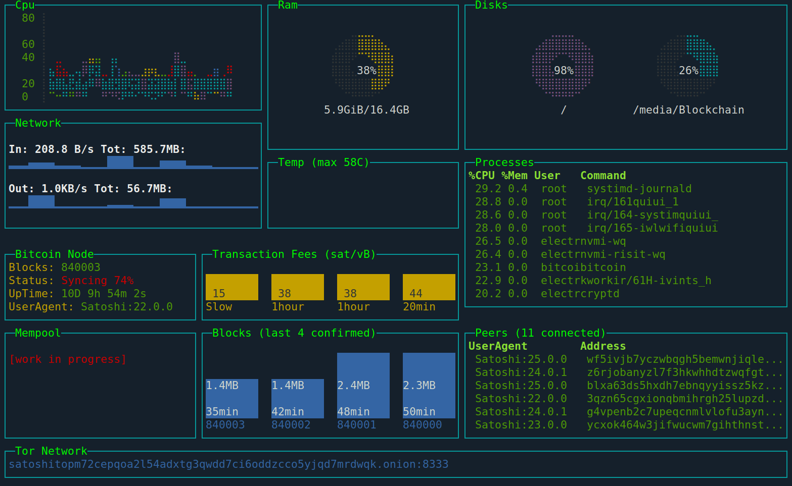

# Satoshi Top

Bitcoin full node monitoring dashboard for terminal.

( Some parts is WORK IN PROGRESS... )


## Use case
You can define it an *htop for Bitcoin*... having a modern dashboard that displays a lot of information similar to a modern bitcoin explorer, but keeping very poor requirements, it doesn't need a graphical environment (ncurses output) and the data exchange is minimal suitable for slow connections like `Tor` and monitors/lcds with low resolution and low fps.

## Features
- general system resources: cpu, mem, disk, network, processes, temperature
- bitcoin core specific: status, blocks, uptime, tor, peers... (WORK IN PROGRESS)

### Possible other features
- http rest interface: this would allow viewing through a browser, while maintaining a tiny, text-only data exchange.
- send text output to mini LCD via tty with low resolution and poor in colors.

Many other features are work in progress, many more [Blessed widgets](https://github.com/chjj/blessed#widgets) and [contrib](https://github.com/yaronn/blessed-contrib#widgets) will be able to be integrated.
This project has been organized in small readable and easy to edit files to encourage contributions from the active community of developers and bitcoiners, every Pull Request and suggestion is welcome.

### Requirements

* Linux / OSX / Windows (partial support)
* Node.js >= v18

## Installation

By official [NPM package](https://npmjs.com/package/satop)

```sh
$ npm install satop -g
```
Copy config file `dot.satoprc.example` in path `$HOME/.satoprc` and add bitcoin `rpcuser` `rpcpassword`.
Don't forget to set restrictive read permissions for this file, for example: `chmod 0600 ~/.satoprc`)

*Snap and Docker* setup is work in progress...

## Usage

Start Satoshi Top with the `satop` command in system terminal(the same system whose resources you want to monitor).

```sh
$ satop
```

If Bitcoin daemon listening in different address(`127.0.0.1`) or a different port(`8333`), you can use command line parameters:

```sh
$ satop --rpcconnect=192.168.0.3 --rpcport=18332
```

To stop satop use `q`, or `ctrl+c` in most shell environments.

Learn more about [command line parameters](docs/cli.md)...

```sh
$ satop --help
```

### Development

```sh
$ npm run dev
```

This script Set environment var `FAKEMODE` to allow simulate a RPC connection(doesn't need Bitcoin Core).

Additional parameter `--intervalrpc=1000` allows to speed up data polling and `nodemon` to reload the code at each edits.


## License

Copyright (c) 2023 [st3b1t](https://github.com/st3b1t) [@st3b1t](https://twitter.com/st3b1t)

Released under [the MIT license](LICENSE).
